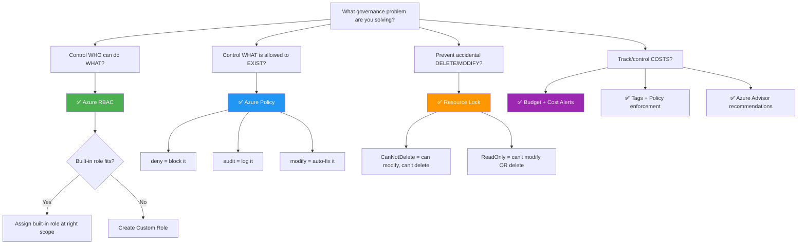

# AZ-104 Exam Day Cheat Sheet

> [!important] Read this the morning of your exam
> These are the top gotchas, traps, and distinctions the exam loves to test. Every item below has tripped up real test-takers.

---

## 🔴 Top 10 Exam Traps

### 1. Tags do NOT inherit
Applying a tag to a resource group does **NOT** tag the resources inside it. Use **Azure Policy** (`Inherit a tag from the resource group`) to enforce inheritance.

### 2. RBAC is checked BEFORE Policy
If RBAC denies the request → Policy is **never evaluated**. RBAC has to say "yes" first, then Policy checks if the resource is compliant.

### 3. Owner vs Contributor — ONE difference
Both can manage all resources. Only **Owner can delegate access** (assign roles). Contributor cannot.

### 4. ReadOnly lock blocks more than you think
ReadOnly lock blocks **any POST operation** — including listing storage account access keys (because that's a POST under the hood). It's not just "you can read but not write."

### 5. Contributor cannot manage locks
Creating/deleting resource locks requires `Microsoft.Authorization/locks/*` — which Contributor doesn't have. You need **Owner** or **User Access Administrator**.

### 6. Budgets alert but don't stop spending
Setting a budget does NOT block spending when the threshold is reached. It only **sends alerts**. You need automation (action groups) to actually shut things down.

### 7. Guest users have restricted directory permissions by default
Guests can only see their own profile. They can't enumerate all users, groups, or apps — unlike member users.

### 8. Management groups max 6 levels deep
6 levels below the Tenant Root Group (not counting root itself). Root group can't be deleted or moved.

### 9. Exported templates = current state, NOT original intent
Exporting a template from a deployment captures what resources look like **now**, including auto-generated values. It needs cleanup before reuse.

### 10. enforcementMode: Disabled still evaluates
`DoNotEnforce` still runs compliance checks and reports results — it just doesn't block anything. "Disabled" ≠ "does nothing."

---

## 🟡 Critical Distinctions (X vs Y)

| X | vs | Y | Key Difference |
|---|---|---|---|
| **RBAC** | vs | **Azure Policy** | RBAC = who can do what (allow). Policy = what can exist (enforce). |
| **Owner** | vs | **Contributor** | Owner can delegate access. Contributor cannot. |
| **Azure RBAC Roles** | vs | **Entra ID Roles** | RBAC = manage resources. Entra = manage identities. |
| **Security Group** | vs | **M365 Group** | Security = access control. M365 = collaboration (email, SharePoint). |
| **System-assigned MI** | vs | **User-assigned MI** | System = 1:1 lifecycle with resource. User = independent, shareable. |
| **Service Principal** | vs | **Managed Identity** | SP = you manage credentials. MI = Azure manages credentials. |
| **CanNotDelete lock** | vs | **ReadOnly lock** | CanNotDelete = can modify. ReadOnly = can't modify OR delete. |
| **Member user** | vs | **Guest user** | Member = full directory access. Guest = restricted by default. |
| **Greenfield** | vs | **Brownfield** | Greenfield = evaluated at create/update. Brownfield = 24h compliance scan. |
| **Conditional Access** | vs | **Security Defaults** | CA = granular rules (P1 needed). SD = blanket MFA for all (Free). |
| **Dynamic Group** | vs | **Assigned Group** | Dynamic = auto-membership by rules (P1). Assigned = manual add/remove. |
| **Control plane** | vs | **Data plane** | Control = manage the resource. Data = use the data inside it. |
| **Policy deny** | vs | **Policy audit** | Deny = blocks the action. Audit = logs it but allows it. |
| **B2B** | vs | **B2C** | B2B = partners/orgs. B2C = consumers (NOT on AZ-104). |

---

## 🟢 License Quick Reference

| License | Unlocks |
|---|---|
| **Free** | Users, groups, SSO, MFA (Security Defaults), SSPR (signed-in only) |
| **P1** | Conditional Access, Dynamic Groups, SSPR (locked-out), Group Licensing, Identity Protection (basic) |
| **P2** | PIM, Access Reviews, full Identity Protection |

---

## 🔧 Governance Decision Flowchart



---

## 📝 Scope Hierarchy (memorize this)

```
Tenant Root Group
    └── Management Groups (max 6 levels below root)
          └── Subscriptions (billing + scale boundary)
                └── Resource Groups (logical container, delete = delete all inside)
                      └── Resources (the actual thing — VM, storage, etc.)
```

**Rules:**
- RBAC, Policy, Locks, Tags — all use this **same hierarchy**
- Everything **inherits downward**
- Most restrictive lock wins
- RBAC is additive (union of all assignments)
- New subscriptions default to **Tenant Root Group**

---

## 🧠 Last-Minute Memory Hooks

- **P1 = automation** (Conditional Access, Dynamic Groups, SSPR locked-out)
- **P2 = privileged access** (PIM, Access Reviews)
- **Security Principal** = umbrella for User, Group, Service Principal, Managed Identity
- **Managed Identity** = service principal where Azure manages credentials
- **Role Assignment** = WHO + WHAT + WHERE
- **Custom roles** = max 5,000 per tenant, AssignableScopes can't be RG-level
- **Tags** = max 50 per resource, don't inherit, use Policy to enforce
- **Compliance scan** = every 24 hours automatically

---

## Related
- [[AZ-104 - Checklist]]
- [[AZ-104 - Command Cheat Sheet]]
- [[Entra ID Licensing Tiers]]
- [[AZ-104 - Azure RBAC]]
- [[AZ-104 - Governance Azure Policy]]
- [[Resource Locks]]
- [[Management Groups]]
