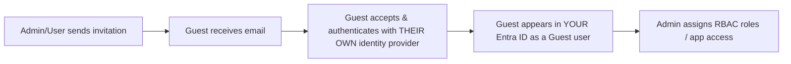

# External Users & B2B Collaboration

## The Problem This Solves

Your organization uses Entra ID to manage employees — but you also need **contractors, partners, vendors, and customers** to access specific resources. You don't want to create full internal accounts for them (that's a security and management nightmare). Instead, you **invite** them as guests.

**Analogy:** Instead of giving a contractor a permanent employee badge and desk, you give them a visitor badge with limited access that expires. They keep their own identity (from their own company) but can access specific rooms in your building.

---

## ⚡ Key Distinctions

| | Member User | Guest User |
|---|---|---|
| **Source** | Created inside your Entra ID tenant | Invited from **outside** (another org's Entra ID, personal Microsoft account, Google, etc.) |
| **UserType property** | `Member` | `Guest` |
| **Default permissions** | Full — can read all users, groups, apps | **Restricted** — can only see their own profile + explicitly shared resources |
| **License** | Counted against your license count | Most features free for up to 50,000 guests (some features require P1/P2) |
| **Analogy** | Full-time employee | Visitor with a badge |

> [!warning] Exam trap — guest permissions
> By default, guest users have **very limited** directory permissions. They can't enumerate all users, groups, or apps. An admin can *increase* guest permissions by changing external collaboration settings, but the default is restrictive.

---

## B2B Collaboration Flow



**Key point:** The guest authenticates with their **home organization's** identity provider — you never manage their password. If their home org enforces MFA, that MFA applies. You can *also* enforce your own [[Conditional Access]] policies on guest sign-ins.

---

## External Collaboration Settings

Found in: **Entra admin center → External Identities → External collaboration settings**

| Setting | Options |
|---|---|
| **Guest user access** | Same as members / Limited / Most restrictive |
| **Guest invite settings** | Anyone can invite / Only admins / Only users with specific role / No one |
| **Collaboration restrictions** | Allow invitations to any domain / Block specific domains / Allow only specific domains |

> [!warning] Exam trap — who can invite guests?
> By default, **all users (including other guests!)** can invite guests. This is the "most permissive" setting. Most orgs restrict this to admins or specific roles.

---

## B2B vs B2C — Don't Confuse Them

| | B2B Collaboration | B2C (Azure AD B2C) |
|---|---|---|
| **Who** | Partners, vendors, contractors (other organizations) | Consumers, customers (individuals) |
| **Identity** | They use their own org's identity | They create a local account or social login |
| **Scope** | AZ-104 ✅ | NOT on AZ-104 ❌ |

---

## Managing External Users

**Creating:** Entra admin center → Users → Invite external user (or via PowerShell/CLI)

```bash
# CLI example — invite a guest
az ad user create --display-name "Jane Partner" \
  --user-principal-name "jane@partner.com" \
  --user-type Guest
```

**Removing:** Delete the guest user object from your directory. This revokes all access immediately — it doesn't affect their home identity.

**Bulk operations:** Use CSV upload for inviting many guests at once.

---

## Quick Quiz

> [!question]- Q1: A guest user tries to list all groups in your Entra ID tenant. Can they?
> **No** (by default) — guest users have restricted directory permissions. They can only see their own profile and resources explicitly shared with them.

> [!question]- Q2: Who manages the guest user's password?
> **Their home organization** — you never manage their password. They authenticate with their own identity provider.

> [!question]- Q3: By default, who can invite guest users to your tenant?
> **Everyone** — all users, including other guests. This is usually restricted in production environments.

> [!example]- Scenario: Contoso needs 50 partner users from Fabrikam to access a SharePoint site. Contoso wants MFA enforced on sign-in. How?
> **Invite the 50 Fabrikam users as B2B guests** (bulk CSV invite). Create a **Conditional Access policy** targeting guest users, requiring MFA. The guests authenticate with Fabrikam's identity but Contoso's Conditional Access policy enforces MFA on their session.

---

## Related
- [[AZ-104 - Create Configure Manage Identities]]
- [[Conditional Access]]
- [[Microsoft Entra ID]]
- [[AZ-104 - Azure RBAC]]
- [[Entra ID Licensing Tiers]]
