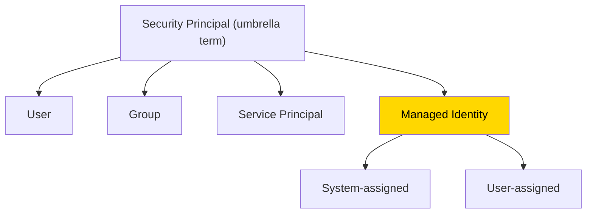

# Managed Identity

## The Problem This Solves

An Azure resource (like a VM or an App Service) needs to access another Azure resource (like a Key Vault or a Storage Account). You *could* store credentials (passwords, keys) in your code or config — but that's a security nightmare. Leaked credentials = breach.

**Fix:** Give the Azure resource its own **identity** that Azure manages automatically. No passwords stored anywhere — Azure handles the credential lifecycle entirely behind the scenes.

**Analogy:** Instead of giving your housekeeper a copy of your house key (a stored credential they could lose), you install a smart lock that recognizes their fingerprint (managed identity). No key to lose, no key to steal, and you can revoke access instantly.

---

## ⚡ Key Distinctions

| | **System-Assigned** | **User-Assigned** |
|---|---|---|
| **Lifecycle** | Tied to the resource — created when the resource is created, **deleted when the resource is deleted** | Independent — lives on its own, survives resource deletion |
| **Sharing** | **1:1** — one identity per resource | **Many:Many** — one identity shared across multiple resources |
| **When to use** | Simple scenarios: one VM talks to one Key Vault | Shared access: 10 VMs all need the same Storage Account access |
| **Analogy** | A name badge sewn into your uniform — lose the uniform, lose the badge | A reusable ID card you carry in your wallet — works at multiple buildings |

---

## Where It Fits in the Security Principal Hierarchy

> [!tip] How Managed Identity relates to Service Principal
> A Managed Identity **is** a special type of Service Principal — one that Azure creates and manages for you automatically. The difference: with a regular service principal, *you* manage the credentials (client secret or certificate). With a managed identity, **Azure handles everything** — no credentials for you to manage, rotate, or leak.

---

## Common Use Cases (exam scenarios)

| Scenario | Managed Identity type | Why |
|---|---|---|
| A VM needs to read secrets from Key Vault | System-assigned | 1:1 relationship, lifecycle tied to the VM |
| An App Service needs to query Azure SQL | System-assigned | Simple, single-resource access |
| 10 VMs in a scale set all need the same Storage Account access | User-assigned | One identity shared across all 10 VMs |
| A CI/CD pipeline resource needs to deploy to multiple subscriptions | User-assigned | Shared across environments, survives redeployments |

---

## How It Works (simplified)

1. Enable managed identity on an Azure resource (e.g., turn on system-assigned identity for a VM)
2. Azure automatically creates a service principal in your Entra ID tenant for that resource
3. Grant that identity an **RBAC role** on the target resource (e.g., "Key Vault Secrets Reader" on a Key Vault)
4. The Azure resource authenticates using a token from the Azure Instance Metadata Service (IMDS) — no password, no key, no certificate
5. Access granted ✅

---

## Quick Quiz

> [!question]- Q1: A VM is deleted. What happens to its system-assigned managed identity?
> It's **deleted too** — the lifecycle of a system-assigned identity is tied to the resource it belongs to.

> [!question]- Q2: Can a managed identity be shared across multiple VMs?
> Only **user-assigned** managed identities can be shared. System-assigned identities are 1:1 with their resource.

> [!question]- Q3: How is a managed identity different from a regular service principal?
> A managed identity is a *type* of service principal where **Azure manages the credentials automatically**. With a regular service principal, you manage the secret/certificate yourself.

> [!example]- Scenario: Your company has 20 Azure Functions that all need to read from the same Cosmos DB. What type of managed identity should you use?
> **User-assigned** — one shared identity assigned to all 20 Functions, instead of creating 20 separate system-assigned identities and granting each one access individually.

---

## Related
- [[AZ-104 - Azure RBAC]]
- [[Service Principal]]
- [[Microsoft Entra ID]]
- [[AZ-104 - Create Configure Manage Identities]]
