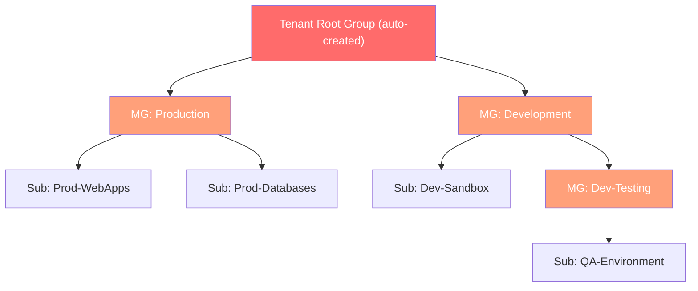

# Management Groups

## The Problem This Solves

You have 20+ subscriptions. You need to apply the **same policies, RBAC, and budgets** across groups of them — but doing it subscription-by-subscription is painful and error-prone. Management Groups let you organize subscriptions into a hierarchy and apply governance at the group level.

**Analogy:** A corporate org chart for subscriptions. The CEO (Tenant Root Group) sets company-wide rules. VPs (Management Groups) set department-specific rules. Individual teams (Subscriptions) inherit all rules from above plus any of their own.

---

## ⚡ Key Distinctions

| Concept A | vs | Concept B | Key Difference |
|---|---|---|---|
| Management Group | vs | Subscription | MG is a *container for subscriptions*; Subscription is a billing/resource boundary |
| Management Group | vs | Resource Group | MG is *above* subscriptions; RG is *below* subscriptions |
| Tenant Root Group | vs | Management Group | Root is auto-created, can't be deleted or moved; MGs are user-created |

---

## The Hierarchy



---

## Key Rules & Limits (exam-tested)

| Rule | Detail |
|---|---|
| **Max nesting depth** | **6 levels** below the root (not counting root itself) |
| **Max MGs per directory** | **10,000** |
| **Parent per MG/subscription** | Exactly **one** — no multi-parent; it's a tree, not a graph |
| **Tenant Root Group** | Auto-created, cannot be deleted or moved. All MGs and subscriptions ultimately live under it |
| **Default behavior** | New subscriptions are placed under the **Tenant Root Group** unless explicitly moved |
| **Who can create MGs?** | Any user with write access on the MG scope (by default, only Global Admin can create at root level) |

> [!warning] Exam trap — nesting limit
> The limit is **6 levels deep** (not counting root). If someone asks about 7 levels of management groups *below* root — that's not allowed.

> [!warning] Exam trap — root group
> The **Tenant Root Group** can't be moved or deleted. Its display name can be changed by a Global Administrator. All other MGs are children of it.

---

## Governance Inheritance Through MGs

Management Groups are the **top of the scope hierarchy** for RBAC, Azure Policy, and budgets:

```
Management Group (governance applied here)
    └── Subscription (inherits ↑)
          └── Resource Group (inherits ↑)
                └── Resource (inherits ↑)
```

**Example:** Apply a "deny resources outside West Europe" policy to the **Production MG** → every subscription under it (Prod-WebApps, Prod-Databases) inherits the restriction → every resource group and resource inside those subscriptions is also restricted.

> [!tip] Same pattern everywhere
> This is the **exact same inheritance model** used by [[AZ-104 - Azure RBAC|RBAC]], [[AZ-104 - Governance Azure Policy|Azure Policy]], and [[Resource Locks]]. The only thing that changes is *what* you're applying at each scope level.

---

## Moving Subscriptions Between Management Groups

- A subscription can be **moved** from one MG to another at any time
- When moved, it **inherits the new MG's policies and RBAC** and **loses the old MG's**
- Moving requires `Microsoft.Management/managementGroups/write` on the target MG

> [!example]- Scenario: A dev team's subscription has been promoted to production. What happens when you move it from the "Development" MG to the "Production" MG?
> The subscription **loses** all Development MG policies/RBAC assignments and **inherits** all Production MG policies/RBAC assignments. Any policies applied directly at the subscription level remain unchanged.

---

## Quick Quiz

> [!question]- Q1: How many levels deep can management groups nest below the Tenant Root Group?
> **6 levels** (not counting the root group itself).

> [!question]- Q2: Can you delete the Tenant Root Group?
> **No** — it's auto-created and permanent. You can change its display name but not delete or move it.

> [!question]- Q3: A new subscription is created. Where does it appear by default?
> Under the **Tenant Root Group**, unless an admin moves it to a specific management group.

> [!question]- Q4: Can a subscription belong to two management groups simultaneously?
> **No** — each subscription has exactly one parent management group. The hierarchy is a tree, not a graph.

> [!example]- Scenario: Your company wants to enforce a "no public IPs" policy across all production subscriptions but not dev subscriptions. How do you structure this?
> Create two management groups: **Production MG** and **Development MG**. Place production subscriptions under Production MG. Assign the "no public IPs" policy to **Production MG** only. Dev subscriptions under Development MG won't be affected.

---

## Related
- [[AZ-104 - Governance Azure Policy]]
- [[AZ-104 - Azure RBAC]]
- [[AZ-104 - Azure Architectural Components]]
- [[Resource Locks]]
- [[Cost Management]]
