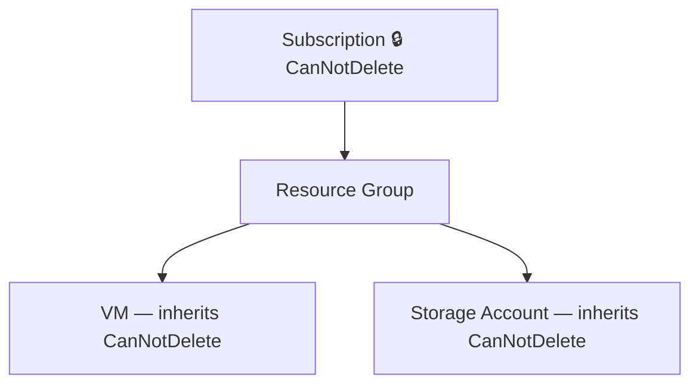

# Resource Locks

## The Problem This Solves

Accidental deletion or modification of critical resources. RBAC controls *who* can do things, but even someone with the Owner role can make a mistake. Resource locks add a **safety net on top of RBAC** — they block specific actions regardless of role.

**Analogy:** RBAC is like a keycard system deciding who can enter a room. A resource lock is like bolting the furniture to the floor — even if you're allowed in the room, you still can't move the desk.

---

## ⚡ Key Distinctions — The #1 Exam Question

| | **CanNotDelete** (Delete Lock) | **ReadOnly** (Read-Only Lock) |
|---|---|---|
| **Can read the resource?** | ✅ Yes | ✅ Yes |
| **Can modify the resource?** | ✅ Yes | ❌ No |
| **Can delete the resource?** | ❌ No | ❌ No |
| **Analogy** | "You can repaint the walls, but you can't demolish the building" | "You can look through the window, but you can't touch anything inside" |

> [!warning] Exam trap — ReadOnly is stricter than it sounds
> A ReadOnly lock doesn't just block writes — it blocks **any operation that requires a POST** in the Azure API. For example, a ReadOnly lock on a **storage account blocks listing access keys** (because listing keys is a POST operation), even though it sounds like a "read" action. This is a very common exam trick.

---

## Lock Inheritance

Locks **inherit downward** through the scope hierarchy — same pattern as RBAC and Azure Policy:

- Apply a lock to a **subscription** → every resource group and resource inside inherits it
- Apply a lock to a **resource group** → every resource inside inherits it
- The **most restrictive** lock wins when multiple locks apply

---

## Who Can Create/Delete Locks?

You need one of these permissions:
- **Owner** role
- **User Access Administrator** role
- Or a custom role with `Microsoft.Authorization/locks/*` permission

> [!warning] Exam trap
> **Contributor cannot create or delete locks.** Even though Contributors can manage all resources, lock management is an authorization action, not a resource action — same pattern as "Contributor can't delegate access" in RBAC.

---

## Locks vs RBAC vs Policy — How They Differ

| | RBAC | Azure Policy | Resource Locks |
|---|---|---|---|
| **Purpose** | Who can do what | What is allowed to exist | Prevent accidental delete/modify |
| **Scope** | Same hierarchy | Same hierarchy | Same hierarchy |
| **Applies to** | Specific users/groups | All users | **All users, including Owner** |
| **Overridable?** | By higher-scoped role | By exemption | Only by removing the lock |

---

## Quick Quiz

> [!question]- Q1: A ReadOnly lock is on a storage account. Can an Owner list the storage account's access keys?
> **No** — listing access keys is a POST operation, and ReadOnly blocks all POST/PUT/DELETE operations, regardless of role.

> [!question]- Q2: A CanNotDelete lock is set on a resource group. Can you delete a VM inside that resource group?
> **No** — locks inherit downward. The VM inherits the CanNotDelete lock from its parent resource group.

> [!question]- Q3: Can a user with the Contributor role create a resource lock?
> **No** — creating/deleting locks requires `Microsoft.Authorization/locks/*` permission, which Contributor doesn't have. You need Owner or User Access Administrator.

> [!question]- Q4: You have both a CanNotDelete lock on a subscription and a ReadOnly lock on a resource group inside it. What's the effective lock on resources in that RG?
> **ReadOnly** (the most restrictive lock wins).

> [!example]- Scenario: Your company's production database must never be deleted, but DBAs need to modify its configuration daily. Which lock type?
> **CanNotDelete** — allows modifications but prevents deletion. ReadOnly would block the DBAs from making configuration changes.

---

## Related
- [[AZ-104 - Azure RBAC]]
- [[AZ-104 - Governance Azure Policy]]
- [[Resource]]
- [[AZ-104 - Azure Architectural Components]]
