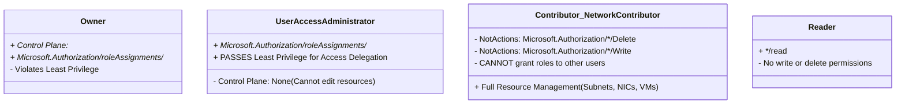
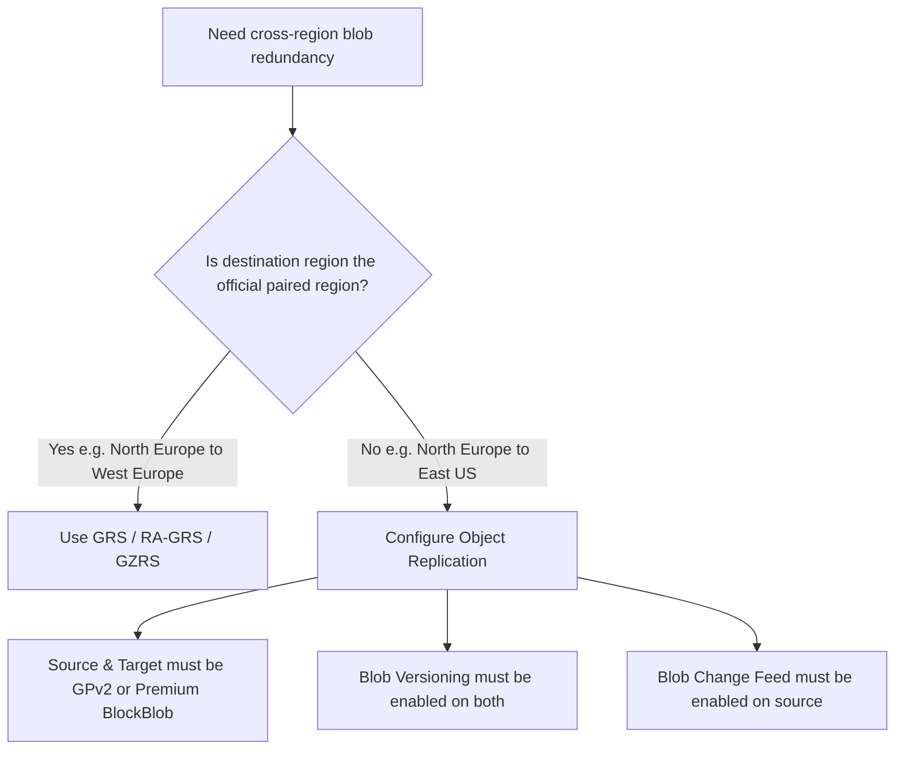

---
tags:
  - AZ-104
  - mistakes-review
  - session-1
  - diagnostic
  - calibration
  - identity-governance
  - networking
  - storage
last-reviewed: 2026-08-31
status: needs-review
domain: identity-governance
aliases:
  - Session 1 Mistakes Review (30 Questions)
  - AZ-104 Diagnostic Session 1
---

# 🎯 AZ-104: Session 1 Comprehensive Mistakes & Diagnostic Review

> [!important] Exam Reality & Session 1 Diagnostics
> **Session 1 Scope:** 30 Questions across 3 Core Modules (10 Networking + 10 Storage + 10 Identity & Governance).
> **Overall Score:** **10 / 30 (33.3%)** · *Status: FAILED (Passing is ~70% / 700 pts)*.
> **Metacognitive Calibration Alert:** **44% accuracy on 🟢 High Confidence questions** (5 questions missed despite complete confidence). Candidates fail the AZ-104 when they pick familiar buzzwords instead of analyzing the underlying mechanism and qualifying constraints.

---

## 📊 Session 1 Performance & Calibration Matrix

```
Total Questions Attempted: 30
Total Correct: 10 (33.3%) | Total Missed: 20 (66.7%)

┌────────────────────────┬─────────────┬───────────┬──────────┬──────────────┐
│ Domain Module          │ Total Quota │ Correct   │ Missed   │ Module Score │
├────────────────────────┼─────────────┼───────────┼──────────┼──────────────┤
│ 🌐 Virtual Networking  │ 10 Qs       │ 4 Correct │ 6 Missed │ 40% 🔴       │
│ 💾 Storage & Data      │ 10 Qs       │ 3 Correct │ 7 Missed │ 30% 🔴       │
│ 🔐 Identity/Governance│ 10 Qs       │ 3 Correct │ 7 Missed │ 30% 🔴       │
└────────────────────────┴─────────────┴───────────┴──────────┴──────────────┘
```

### 🎯 Confidence Calibration Breakdown:
- **🟢 High Confidence (9 Qs):** 4 Correct, **5 Missed (44% Accuracy)** $
$\rightarrow$$ *Critical False-Mastery Blindspots*.
- **🟡 Medium Confidence (6 Qs):** 3 Correct, 3 Missed (50% Accuracy) $
$\rightarrow$$ *Shaky Architectural Boundaries*.
- **🔴 Low / Unrated Confidence (15 Qs):** 3 Correct (Lucky Guesses), 12 Missed (20% Accuracy) $
$\rightarrow$$ *Foundational Gaps*.

---

## ⚠️ Layer 0: Jargon Radar (Pre-Note Tripwires)

- **Overloaded Word: "Contributor":** In plain English, a contributor can edit everything. In Azure RBAC, all `-Contributor` roles have a hard `NotActions` rule on `Microsoft.Authorization/*/Write` and `Microsoft.Authorization/*/Delete`. They **CANNOT assign roles or delegate permissions to others**.
- **False Friend: "Location":**
  - *Usage Location:* Mandatory 2-letter ISO country code (`US`, `GB`) in user profile required by compliance laws to activate cloud service licenses.
  - *Office Location:* Optional text string in contact info (e.g. "Room 302"). Has **0 effect on licensing**.
- **False Friend: "Service Endpoint" vs "VNet Peering":**
  - *Service Endpoint:* Routes traffic directly from a subnet to an Azure **PaaS service** (Storage, SQL) over the MS backbone.
  - *VNet Peering:* Connects **two Virtual Networks** together (VM-to-VM, custom DNS). Service Endpoints **cannot** connect VNets.
- **Overloaded Word: "Policy":**
  - *Built-in Policy:* General templates (Allowed SKUs, Allowed Locations). **Never contains arbitrary custom ports like 8080**.
  - *Custom Policy:* Required JSON definition whenever corporate rules demand custom ports, regex naming, or complex rules.
- **False Friend: "Azure Bastion" vs "Application Gateway":**
  - *Bastion:* Administrative in-browser RDP/SSH jumpbox targeting **IaaS Virtual Machines only** (Inbound TCP 443).
  - *App Gateway:* Layer 7 reverse proxy / WAF for **HTTP/HTTPS web applications**. Cannot jumpbox into VMs.

---

## 📖 Layer 2: Grounded Beginner Glossary (5 Columns)

| Term | Plain English Definition | Real-World Analogy | Verified Real Example (Portal / CLI / Property) | Why It's Confusable (False Friends) |
|---|---|---|---|---|
| **User Access Administrator** | Built-in role allowing users to assign/revoke RBAC roles without modifying resources. | A security badge clerk who prints building access cards but cannot build walls. | `az role assignment create --role "User Access Administrator" --assignee <user> --scope <vnet_id>` | Often confused with Contributor roles. Contributor cannot grant access to others. |
| **Object Replication** | Asynchronous block blob copy between storage accounts in any custom region. | A photocopier that duplicates every new document and mails it to a branch office. | `Portal: Storage > Object replication > Create replication rules` | GRS only copies to predetermined paired regions; Object Replication copies anywhere. |
| **Usage Location** | Mandatory user account property required before assigning M365 / Entra ID licenses. | Specifying your legal country residence before activating cellular service. | `az ad user update --id user1@contoso.com --usage-location US` | Distinct from Azure resource regions or office location strings. |
| **General-Purpose v2 (GPv2)** | Modern storage account tier supporting lifecycle management, all tiers, and ZRS conversion. | A modern smartphone supporting all latest app features vs an old feature phone (GPv1). | `az storage account update --name storage1 --set kind=StorageV2` | GPv1 accounts cannot be directly converted to ZRS in the portal without upgrading first. |
| **Azure Bastion** | Fully managed PaaS jumpbox inside a VNet for browser-based VM access without public IPs. | A locked security entrance where staff show ID and are escorted to server rooms. | Subnet requirement: `AzureBastionSubnet` (/26 min). Inbound port: TCP 443. | Only protects IaaS VMs. Cannot protect App Services or DNS zones. |
| **IdFix Tool (`idfix.exe`)** | On-premises utility that discovers and remediates invalid characters in Active Directory UPNs before sync. | A spellchecker that highlights illegal symbols on passport applications before submission. | `Run idfix.exe > Query > Edit invalid characters > Apply` | Must be run on-premises in AD DS before Entra Connect syncs. |
| **`Add-AzVhd`** | PowerShell cmdlet to upload on-premises generalized VHD disks to Azure blob storage. | Shipping a standardized computer hard drive to a remote cloud datacenter. | `Add-AzVhd -Destination <blob_uri> -LocalFilePath <path.vhd> -ResourceGroupName <rg>` | `Add-AzImage` creates an image object *from* an existing managed disk, not an upload tool. |

---

## 🏗️ Layer 3: Architectural Mental Models & Resource Hierarchy

### 1. RBAC Control Plane vs. IAM Delegation Architecture


### 2. Cross-Region Replication vs. Regional Pairing Flowchart


### 3. VNet Peering vs. Service Endpoint Traffic Routing
```mermaid
flowchart LR
    subgraph VNET1[VNet 1 (10.1.0.0/16)]
        VM1[VM1: Custom DNS Server<br/>10.1.0.4]
        Subnet1[Subnet 1]
    end

    subgraph VNET2[VNet 2 (10.2.0.0/16)]
        VM2[VM2: Client VM]
    end

    subgraph PaaS[Azure Storage / SQL]
        StorageAcct[(Storage Account)]
    end

    VM2 -->|VNet Peering (Port 53 DNS / VM-to-VM)| VM1
    Subnet1 -->|Service Endpoint (Microsoft.Storage)| StorageAcct
```

---

## ⚖️ Layer 4: Decision Trees, Qualifier Drills & Confusable Pairs

### 1. Master Qualifier Decision Matrix
| Scenario / Requirement | Qualifier Word | Best Azure Choice | Why Other Options Fail |
|---|---|---|---|
| Enable User1 to assign Reader role on VNet1 to others | **Least Privilege** | **User Access Administrator on VNet1** | Network Contributor has 0 IAM rights; Owner grants excessive deletion power. |
| Replicate blobs from North Europe to East US | **Least Admin Effort / Non-Paired** | **Object Replication** | GRS only replicates to West Europe (hardcoded pair). |
| Ensure newly created NSGs across 10 VNets block port 8080 | **Required Mechanism** | **Custom Policy Definition (JSON) assigned to Subscription** | Built-in policies do not have arbitrary port 8080 definitions. |
| Protect GPv1 LRS account against zone failure | **Least Cost / Effort** | **Upgrade to GPv2 first, then convert to ZRS** | GPv1 does not support direct ZRS replication in portal. |
| Connect Windows 10 home computer to Azure File Share | **Required Protocol** | **Open Outbound TCP Port 445 (SMB)** | Port 3389 is RDP; Port 443 is HTTPS/REST. |
| Connect to Windows/Linux VM via browser without public IP | **Most Secure Management** | **Azure Bastion (Inbound TCP 443)** | App Gateway is for HTTP web apps, not RDP/SSH jumpbox sessions. |
| P2S VPN client cannot access newly peered VNet2 | **Required Action** | **Download & reinstall VPN client package** | Client's local routing table was generated before peering existed. |
| Prepare on-prem Active Directory UPNs with illegal symbols for sync | **Least Admin Effort** | **Run `idfix.exe` and use Edit action** | Manual ADUC editing takes hours; UPN suffix changes break on-prem logon. |
| Upload on-prem generalized Windows VHD to Azure | **PowerShell Cmdlet** | **`Add-AzVhd`** | `Add-AzImage` creates a managed image from an existing cloud disk. |
| Blob modified 6 days ago matches Rule 1 (Cool >5d), Rule 2 (Delete >5d), Rule 3 (Archive >5d) | **Precedence Rule** | **Blob is Deleted** | Lifecycle management applies the *least expensive action* (Delete). |

### 2. Confusable Pairs Separator
| Service Pair | The One-Line Rule That Separates Them |
|---|---|
| **Network Contributor vs User Access Administrator** | **Network Contributor** builds network plumbing (subnets, NICs) but cannot assign roles. **User Access Administrator** assigns roles but cannot touch plumbing. |
| **GRS vs Object Replication** | **GRS** replicates only to the *fixed paired region*. **Object Replication** copies blobs to *any custom region or account* you specify. |
| **Built-in Policy vs Custom Policy** | **Built-in** enforces broad cloud hygiene (Allowed SKUs, Allowed Locations). **Custom** is required for *numeric custom ports (8080)* or corporate regex. |
| **Azure Bastion vs Application Gateway** | **Bastion** provides browser-based administrative RDP/SSH to *Virtual Machines*. **App Gateway** load balances public *Web Applications*. |
| **RDP TCP 3389 vs UDP 3389** | **TCP 3389** is mandatory for the initial connection handshake. **UDP 3389** is optional for stream acceleration (blocking TCP breaks RDP). |

---

## ⚠️ Layer 5: Critical Exam Traps

> [!danger] Trap 1: Contributor Roles Never Have IAM Write Rights
> Any option suggesting `Contributor`, `Network Contributor`, or `Virtual Machine Contributor` to delegate access, grant roles, or manage permissions is **100% false**. Always choose **User Access Administrator** (or Owner).

> [!danger] Trap 2: GRS Region Pairing is Hardcoded by Microsoft
> You **cannot choose the destination region in GRS**. If a question specifies replicating from region X to non-paired region Y (e.g. North Europe $
$\rightarrow$$ East US), **GRS is a distractor**. You must configure **Object Replication**.

> [!warning] Trap 3: Usage Location is Mandatory for Licensing
> If an Azure AD user has no **Usage Location**, any attempt to assign an M365 or Entra ID license (individually or via group) will fail with an error. Always check Usage Location when troubleshooting licensing failures.

> [!warning] Trap 4: Nested Group Licensing is Unsupported
> In Microsoft Entra ID, group-based licensing does **not** inherit through nested sub-groups. Only direct members of the assigned group receive licenses.

> [!caution] Trap 5: P2S VPN Client Routing Tables are Static
> When you add new subnets or peerings to a VNet with an active Point-to-Site VPN Gateway, existing connected clients **will not automatically learn the new routes**. The client must **re-download and install the VPN client configuration package**.

---

## 💻 Layer 6: Portal + CLI + PowerShell Parity

| Administrative Task | Azure Portal Click-Path | Azure CLI (`az`) | Azure PowerShell (`Az`) |
|---|---|---|---|
| **Assign User Access Admin** | `Resource > IAM > Add role assignment > User Access Administrator` | `az role assignment create --role "User Access Administrator" --assignee <user> --scope <id>` | `New-AzRoleAssignment -SignInName <user> -RoleDefinitionName "User Access Administrator" -Scope <id>` |
| **Set User Usage Location** | `Entra ID > Users > [User] > Properties > Edit > Usage location` | `az ad user update --id <upn> --usage-location US` | `Update-MgUser -UserId <upn> -UsageLocation "US"` |
| **Upgrade Storage to GPv2** | `Storage account > Configuration > Upgrade to General-purpose v2` | `az storage account update --name <name> --set kind=StorageV2` | `Set-AzStorageAccount -ResourceGroupName <rg> -Name <name> -UpgradeToStorageV2` |
| **Create Custom Policy** | `Azure Policy > Definitions > + Policy definition > Paste JSON` | `az policy definition create --name <name> --rules <json_path>` | `New-AzPolicyDefinition -Name <name> -Policy <json_path>` |
| **Deploy Azure Bastion** | `Portal > Create a resource > Azure Bastion` | `az network bastion create --name Bastion1 --vnet-name VNet1 --public-ip-address IP1` | `New-AzBastion -ResourceGroupName <rg> -Name Bastion1 -PublicIpAddress $pip -VirtualNetwork $vnet` |
| **Upload On-Prem VHD** | `Storage > Containers > Upload` (or AzCopy) | `azcopy copy "<local_path.vhd>" "<blob_sas_url>"` | `Add-AzVhd -Destination <blob_uri> -LocalFilePath <path.vhd> -ResourceGroupName <rg>` |

---

## ❓ Layer 7: Active Recall Drills (Directly Targeting Session 1 Mistakes)

> [!question]- 1. You need to enable User1 to assign the Reader role on VNet1 to other users with least privilege. User1 currently has Reader and Security Admin. What role should you assign?
> **Answer:** **User Access Administrator** on VNet1.
> **Why it works:** `User Access Administrator` grants `Microsoft.Authorization/roleAssignments/write` at the VNet1 scope without granting network infrastructure modification rights (least privilege).

> [!question]- 2. Storage account `storage1` is in North Europe. You need a secondary copy created in East US with minimal administrative effort. What should you configure?
> **Answer:** **Object Replication**.
> **Why it works:** North Europe's paired region is West Europe. Because East US is a non-paired region, GRS cannot be used. Object Replication allows policy-driven blob copies to any region.

> [!question]- 3. You attempt to assign an Entra ID Premium P2 license to a user and receive an error stating license assignment failed. What profile attribute must you modify?
> **Answer:** **Usage location** (under User Properties).
> **Why it works:** Microsoft cloud service licensing legally requires a designated country jurisdiction (`UsageLocation`) before service activation.

> [!question]- 4. You have 10 VNets in separate resource groups. You need to ensure any newly created NSG automatically blocks TCP port 8080. Solution: You assign a built-in policy definition to the subscription. Does this meet the goal?
> **Answer:** **No**.
> **Why it fails:** There is no built-in policy in Azure that specifically targets and blocks TCP port 8080. You must author and assign a **Custom Policy Definition**.

> [!question]- 5. Several on-premises user accounts in `humongousinsurance.com` contain unsupported special characters in their UPNs before synchronizing to Microsoft Entra ID. What should you do?
> **Answer:** Run **`idfix.exe`** and use the **Edit** action.
> **Why it works:** `IdFix` is Microsoft's official directory synchronization error remediation tool that scans on-prem AD DS and provides bulk correction actions.

> [!question]- 6. You deploy Azure Bastion to VNet1. VNet1 hosts VM1, an App Service web app named App1, and a private DNS zone contoso.com. Which resources can Bastion protect?
> **Answer:** **VM1 only**.
> **Why it works:** Azure Bastion is strictly an RDP/SSH jumpbox for IaaS Virtual Machines. It has no proxy capabilities for PaaS Web Apps or DNS zones.

> [!question]- 7. An NSG inbound rule allows `Port 3389` with `Protocol: UDP`. Can users establish Remote Desktop connections from the Internet?
> **Answer:** **No**.
> **Why it fails:** Remote Desktop Protocol session initiation strictly requires **TCP port 3389**. Blocking TCP breaks the connection handshake completely.

> [!question]- 8. A Windows 10 laptop on a Point-to-Site VPN connects to VNet1. After VNet1 is peered to VNet2, on-prem connects to VNet2, but the laptop cannot. What must you do?
> **Answer:** **Download and reinstall the VPN client configuration package** on the laptop.
> **Why it works:** P2S VPN client routing tables are generated at download time and do not dynamically learn new peered routes without reinstalling the package.

> [!question]- 9. A blob stored on June 1 in Hot tier matches three lifecycle rules on June 7: Rule 1 (Cool >5d), Rule 2 (Delete >5d), Rule 3 (Archive >5d). What is the state of the blob on June 7?
> **Answer:** **Deleted**.
> **Why it works:** When multiple lifecycle actions match on the same blob, Azure applies the **least expensive action** (`Delete` > `tierToArchive` > `tierToCool`).

> [!question]- 10. You configure a generalized reference VM in your on-premises environment. You need to upload the generalized VHD to Azure via PowerShell. Which cmdlet should you use?
> **Answer:** **`Add-AzVhd`**.
> **Why it works:** `Add-AzVhd` is the dedicated Azure PowerShell cmdlet for uploading on-prem virtual hard disk files to Azure Storage blob containers.

---

## 🔗 Related Vault Notes
- [[AZ-104 - Study Dashboard]]
- [[AZ-104 - Exam Day Cheat Sheet]]
- [[AZ-104 - Command Cheat Sheet]]
