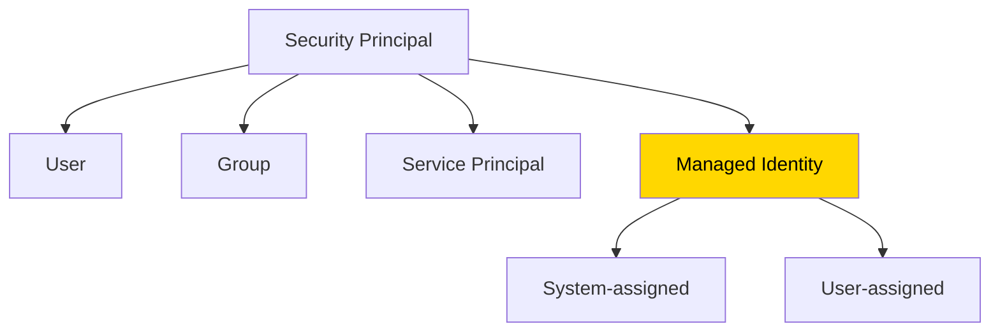
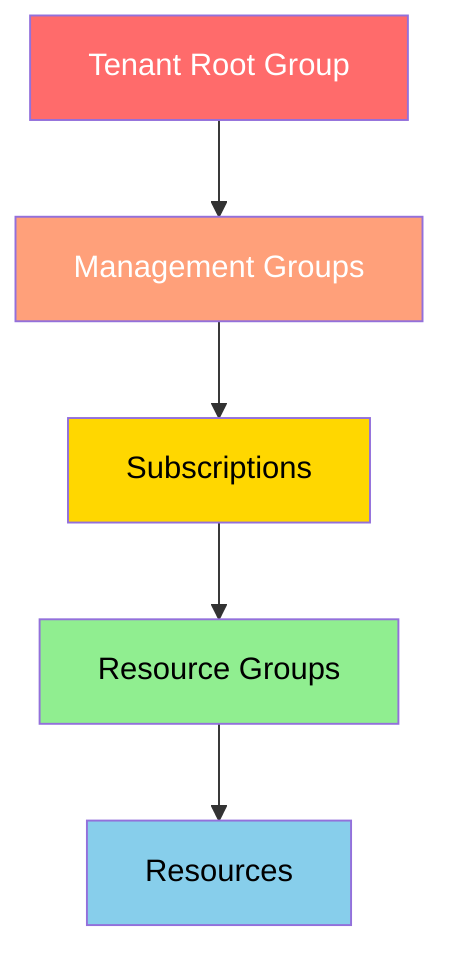
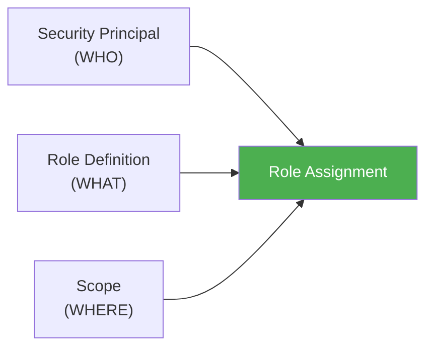

# Azure RBAC (Role-Based Access Control)

## ⚡ Key Distinctions (quick-reference)

| Concept A | vs | Concept B | Key Difference |
|---|---|---|---|
| Owner | vs | Contributor | Owner can delegate access, Contributor cannot |
| RBAC | vs | Azure Policy | RBAC = who can do what (allow); Policy = what can exist (enforce) |
| Azure RBAC Roles | vs | Entra ID Roles | RBAC = manage Azure resources; Entra = manage identities/directory |
| Security Group | vs | M365 Group | Access control vs Collaboration |
| Allow model (RBAC) | vs | Deny wins (NSGs) | RBAC permissions are additive; NSG deny overrides allow |

---

## What Problem Does This Solve?

Organizations worry about two things with cloud access:
1. When someone leaves the org, they should **lose access immediately**
2. Teams need the **right balance** of autonomy vs. central control (e.g. let a project team create/manage its own VMs, but centrally control the network those VMs connect to)

**Definition:** Azure RBAC is an authorization system built on Azure Resource Manager that gives **fine-grained access management** — the exact access a person/app needs to do their job, no more, no less.

**Analogy:** A hotel keycard system. Not everyone gets a master key — housekeeping gets access to guest rooms only, management gets access to everything, a specific contractor gets access to just the one floor they're renovating. Same building, different scoped keys.

**Example situation:** One employee needs to manage VMs in a subscription. Another needs to manage SQL databases in that *same* subscription. RBAC lets you grant exactly those two different scopes of access without either person having the other's permissions.

---

## The Foundation: Subscriptions & Entra ID

- Each Azure subscription is tied to a **single Microsoft Entra tenant**
- Users/groups/apps in that tenant's directory can be granted access to manage resources in the subscription
- **Microsoft Entra Connect** extends this to on-prem AD — employees use their existing on-prem work identity for SSO into Azure. If an employee is disabled in on-prem AD, they **automatically lose access** to all connected Azure subscriptions — this directly addresses concern #1 above.

---

## The 3 Building Blocks: Who, What, Where

Every RBAC role assignment is made of exactly three elements.

### 1. Security Principal — "WHO"

**Definition:** A fancy umbrella term for *anything you can grant access to*. Not a separate special thing — it's the category name covering four possible types:

| Type | What it is | Example |
|---|---|---|
| **User** | A human's Entra ID account | Your own admin login |
| **Group** | A collection of users | The "Marketing" security group |
| **[[Service Principal]]** | An **application/service's own identity** — not a human | An automated deployment pipeline that needs to create resources without a person typing credentials |
| **[[Managed Identity]]** | A **special type of service principal** where Azure manages the credentials automatically | A VM that reads secrets from Key Vault — no password stored anywhere |

> [!tip] The term that confused you
> "Security principal" isn't its own separate category from user/group/service principal — it's the **parent term** that covers all four. If a question asks "what security principals can be assigned a role," the answer is: users, groups, service principals, AND managed identities — all four qualify.

**Analogy:** "Security principal" is like the word "vehicle" — a car, truck, motorcycle, and electric scooter are all vehicles, but "vehicle" isn't a fifth separate thing sitting next to them. User, Group, Service Principal, and Managed Identity are the four "vehicle types" under the "security principal" umbrella.

**Service principal example:** A CI/CD pipeline (like Azure DevOps or GitHub Actions) needs to automatically deploy resources every time code is pushed. You don't want it logging in as a human user with a password — instead, it gets its own **service principal** identity with exactly the permissions it needs (e.g. Contributor on one resource group), nothing more.

**Managed identity example:** A VM needs to read secrets from Key Vault. Instead of storing a password or key in the VM's config, you enable a **system-assigned managed identity** on the VM and grant it the "Key Vault Secrets Reader" role — Azure handles all the credential management behind the scenes.

---

### 2. Role Definition — "WHAT"

**Definition:** A collection of permissions — what actions are actually allowed (read, write, delete, etc.). Sometimes just called a "role."

**Analogy:** A job description — it lists exactly what tasks someone in that role is allowed to perform, nothing about who's doing it or where.

**4 fundamental built-in roles:**

| Role | What it allows |
|---|---|
| **Owner** | Full access to all resources, **including the right to delegate access to others** |
| **Contributor** | Create/manage all resource types, but **cannot** grant access to others |
| **Reader** | View existing resources only — no changes |
| **User Access Administrator** | Manage user access to Azure resources (but not the resources themselves) |

> [!warning] Owner vs Contributor — the exam-favorite distinction
> Both can fully manage resources. The difference is **only** whether they can grant/manage access for other people. Owner can. Contributor cannot. This exact distinction shows up constantly in RBAC scenario questions (you've already seen versions of it in your practice question dump — "assign X the Reader role to others" type questions).

If none of the built-in roles fit, you can create **custom roles**.

---

### 3. Scope — "WHERE"

**Definition:** The level at which the access applies. Same 4-level hierarchy as governance: **Management Group → Subscription → Resource Group → Resource**.

**Analogy:** A job title tells you *what* someone can do; scope tells you *which building* they're allowed to do it in.

**Key rule — inheritance:** Access granted at a parent scope automatically flows down to all child scopes. Grant Contributor at the subscription level → that person is Contributor for every resource group and resource inside it too.

> [!tip] Same hierarchy, same inheritance — RBAC and Azure Policy
> RBAC and [[AZ-104 - Governance Azure Policy|Azure Policy]] both use this **exact same scope hierarchy** and **downward inheritance**. The difference: RBAC controls **who can do what** (allow model), Policy controls **what is allowed to exist** (compliance enforcement). RBAC is checked **before** Policy — if RBAC denies the request, Policy is never evaluated.

**Example situation:** You want someone to be a "Website Contributor," but only for **one specific resource group**, not the whole subscription. Set the scope narrowly at the Resource Group level instead of the Subscription level — this is exactly the "principle of least privilege" pattern from your earlier practice questions.

---

## Putting It Together: Role Assignment

**Definition:** A role assignment = binding a **role definition** to a **security principal** at a particular **scope**. This is the actual mechanism that grants access. Remove the assignment to revoke access.

**Example situation:** The "Marketing" group (security principal) is assigned the Contributor role (role definition) at the "sales resource group" scope (scope) → everyone in Marketing can now create/manage resources in that one resource group, nowhere else.

---

## Azure RBAC in the Portal

You'll see a pane called **Access control (IAM)** — "IAM" = **Identity and Access Management**. This is where you view who has access to a scope and their role, and where you grant/remove access.

---

## RBAC Is an "Allow Model"

**Definition:** RBAC only has **allow** rules — you can't create a "deny" role assignment the way you can with NSG deny rules. If one role assignment grants you read access to a resource group, and a different assignment grants write access to that same resource group, you end up with **both** read and write (permissions are additive).

> [!warning] Don't confuse this with NSGs
> Your Networking notes cover NSGs where **Deny always wins**. RBAC works completely differently — it's purely additive/allow-based. There's no "deny wins" concept in role assignments. (Note: Azure does now have a separate feature called "deny assignments" used in specific scenarios like Azure Blueprints/managed apps, but that's not part of standard day-to-day RBAC role assignment.)

### NotActions
**Definition:** Some roles use `NotActions` — actions **excluded** from an otherwise broad `Actions` grant. The *effective* permissions = `Actions` minus `NotActions`.

**Example:** Contributor has `Actions: "*"` (all operations) but `NotActions` excludes things like:
- Delete/create roles and role assignments
- Grant/update User Access Administrator access at tenant scope
- Create/update/delete blueprint artifacts

**Analogy:** A master key that opens every door in the building **except** a few specifically excluded ones (the server room, the vault) — broad access with specific carve-outs.

---

## Azure RBAC Roles vs Entra ID Directory Roles

> [!warning] Don't confuse these — they're different role systems

| | Azure RBAC Roles | Entra ID Directory Roles |
|---|---|---|
| **What they manage** | Azure **resources** (VMs, storage, networks) | **Identities and directory settings** (users, groups, app registrations) |
| **Example roles** | Owner, Contributor, Reader, User Access Administrator | Global Administrator, User Administrator, Groups Administrator |
| **Where you assign them** | Resource / RG / Subscription / Management Group | Entra ID tenant (directory-wide) |
| **Managed in** | Access control (IAM) blade | Entra admin center → Roles and administrators |

**Analogy:** Azure RBAC = "who can do what inside the office" (the Azure resources). Entra roles = "who can manage the employee directory and building access system" (the identities).

See also: [[Azure Tenant]] (where this distinction was first introduced in your notes).

---

## RBAC vs Azure Policy — The Top Exam Distinction

| | RBAC | Azure Policy |
|---|---|---|
| **Purpose** | **Who** can do what | **What** is allowed to exist |
| **Model** | Allow (additive) | Enforce (deny / audit / modify) |
| **Scope** | Same hierarchy | Same hierarchy |
| **Inheritance** | Downward | Downward |
| **Evaluated when** | Every resource request | Greenfield (create/update) + brownfield (24h scan) |
| **Order** | RBAC checked **first** | Policy checked **after** RBAC passes |
| **Can be overridden?** | By higher-scoped assignment | By exemption |

> [!warning] Exam trap — evaluation order
> If a user **lacks RBAC permission** to create a resource, Azure Policy is **never even evaluated**. RBAC fails the request first. Policy only runs after RBAC says "yes, you're allowed."

See also: [[AZ-104 - Governance Azure Policy]] for the Policy side of this comparison.

---

## Quick Quiz

> [!question]- Q1: Is "security principal" a separate 5th category alongside user/group/service principal/managed identity?
> No — it's the umbrella term covering all four. User, Group, Service Principal, and Managed Identity are the four types of security principal.

> [!question]- Q2: What's a service principal, in plain terms?
> An identity used by an application or automated service (not a human) to authenticate and act with specific permissions.

> [!question]- Q3: What's the one key difference between Owner and Contributor?
> Owner can delegate/grant access to others. Contributor can manage all resources but cannot grant access to anyone else.

> [!question]- Q4: A role is assigned Contributor at the subscription scope. Does that person automatically get Contributor on every resource group inside that subscription?
> Yes — scope inherits downward through the hierarchy.

> [!question]- Q5: If one role assignment grants Read on a resource group, and another grants Write on the same resource group, what access does the user end up with?
> Both — RBAC is a pure allow model, permissions from different assignments are additive.

> [!question]- Q6: What does NotActions do in a role definition?
> Excludes specific actions from an otherwise broad Actions grant — effective permissions = Actions minus NotActions.

> [!question]- Q7: A VM needs to read secrets from Key Vault without storing any credentials. What type of security principal should be used?
> A **Managed Identity** (system-assigned) — Azure manages the credentials automatically, nothing stored in code.

> [!example]- Scenario: A junior admin needs to deploy VMs in the Sales-RG but should NOT be able to grant anyone else access. What built-in role?
> **Contributor** — can manage all resources but cannot delegate access to others.

> [!example]- Scenario: An auditor needs to view all resources in a subscription but must not change anything. You also want to prevent accidental deletion of critical resources. What role + what governance tool?
> **Reader** role (RBAC) for view-only access + a **CanNotDelete resource lock** on critical resources. See [[Resource Locks]].

---

## Related
- [[AZ-104 - Identity AD DS to Entra ID]]
- [[AZ-104 - Governance Azure Policy]]
- [[AZ-104 - Create Configure Manage Identities]]
- [[Resource Locks]]
- [[Managed Identity]]
- [[Entra ID Licensing Tiers]]
- [[Azure Tenant]]
- [[Custom RBAC Roles]]
- [[External Users and B2B]]
- [[Management Groups]]
